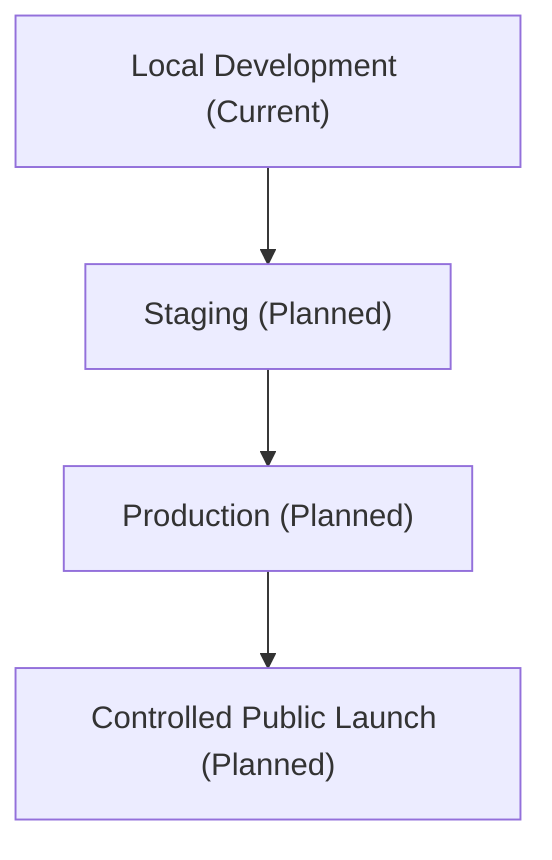

# 01. Product and System Context

**Document status:** Proposed Target Architecture  
**Implementation status:** Not Fully Implemented  
**Review status:** Subject to Current-System Audit

## Product Purpose

Cyberly is an AI-powered cyber wellness toolkit for Malaysian teenagers. Its production direction is to help learners understand online safety concepts, practise through scenarios, receive safe guidance from CyberGuard, and follow clear learning steps without exposing private data or allowing AI to mutate protected domain state.

The Capstone prototype has established a working product foundation. This specification defines the intended production architecture that should guide cleanup, audits, migration planning, and future implementation.

## Current Operating Mode

Cyberly is currently treated as a local-development product. The earlier Render backend and Aiven MySQL deployment was prototype infrastructure and is being retired. It should not be treated as the target production architecture.

Future environments should follow:

No exact public launch date is guaranteed by this document.

## Primary Product Capabilities

Current repository documentation describes a React frontend, Express backend, MySQL database, session authentication, learner profile flow, assessment, progress tracking, resources, scenarios, CyberGuard AI chat, RAG grounding, controlled Agentic proposals, and Admin governance foundations.

This specification does not claim that planned production capabilities such as full learning-event sourcing, persistent proposals, analytics dashboards, staging infrastructure, or complete content versioning already exist.

## Target System Qualities

- Safe for teenage learners.
- Clear separation between account identity and learner-specific educational state.
- Human-governed content and RAG readiness.
- AI assistance that is grounded, auditable, and unable to directly change protected state.
- Forward-only migration discipline.
- Production operations that are observable, recoverable, and privacy-conscious.

## Stakeholders

- Learners: use Cyberly to learn cyber wellness topics.
- Parents, educators, and supervisors: need trust in safety and learning value.
- Admin/content reviewers: govern content, source quality, RAG readiness, and safety.
- Developers/operators: maintain reliability, security, data integrity, and deployment quality.

## Production Boundary

Infrastructure is a supporting technical layer, not a business domain. Business architecture should be expressed through Identity, Learner, Learning, Content, AI, Agentic, Administration, and Analytics domains.
