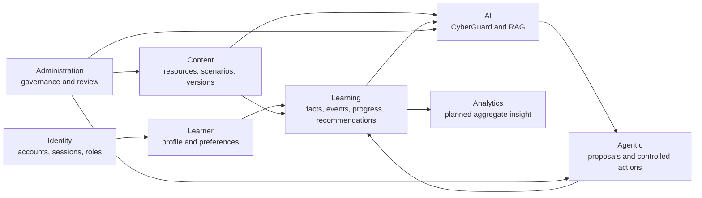

# 02. Domain Architecture

**Document status:** Proposed Target Architecture  
**Implementation status:** Not Fully Implemented  
**Review status:** Subject to Current-System Audit

## Target Domains

Cyberly production architecture should be organized around these domains:

- Identity
- Learner
- Learning
- Content
- AI
- Agentic
- Administration
- Analytics

Infrastructure supports these domains but is not itself a business domain.

## Domain Responsibilities

### Identity

Owns account identity, authentication, sessions, roles, account status, and display name. The target decision is that `users` remains a general account table and `display_name` remains in `users`.

### Learner

Owns learner-specific profile information and preferences. Learner-specific age information belongs in `learner_profiles`; target production design prefers `birth_year` over full date of birth or permanently stored age.

### Learning

Owns assessment facts, learning events, progress snapshots, recommendations, scenario attempts, and learning-route state. Assessment records learning facts. Learning Events are the intended source of truth for learning-state changes. Progress is a materialized/current-state snapshot. Recommendations are historical system decisions.

### Content

Owns Resource and Scenario definitions, translations, source metadata, publication state, review state, and content relationships. Scenario and Resource content should support stable identity and versioned publication.

### AI

Owns CyberGuard generation, provider orchestration, prompt boundary, RAG retrieval, safety checks, and persisted source citations. RAG data is derived and rebuildable.

### Agentic

Owns controlled action proposals, confirmation, execution, idempotency, and audit. AI cannot directly update protected domain state.

### Administration

Owns governance workflows for content review, source metadata, RAG readiness, safety review, Malaysia guidance, role-limited operations, and future audit trails.

### Analytics

Owns aggregate product and learning insights. This is a planned target domain; it must not expose raw private learner data unnecessarily.

## Conceptual Domain Relationships

## Boundary Rules

- Identity must not become a storage area for learner learning-state data.
- Learner profile data must not contain raw assessment answers or scenario decisions.
- Learning state changes should be represented through facts/events before being reflected in snapshots.
- Content publication does not automatically mean RAG-ready.
- AI may suggest, explain, and propose, but it must not directly mutate protected state.
- Agentic execution must go through controlled backend handlers.
