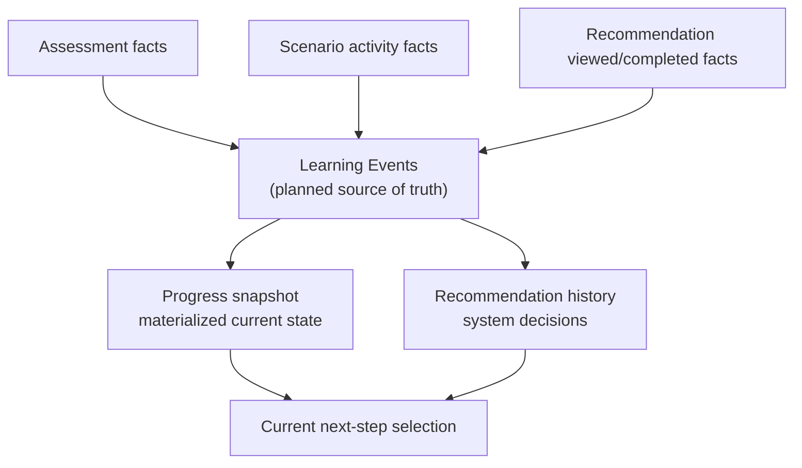

# 03. Data Architecture

**Document status:** Proposed Target Architecture  
**Implementation status:** Not Fully Implemented  
**Review status:** Subject to Current-System Audit

## Data Principles

- Keep account identity separate from learner profile and learning state.
- Prefer stable identifiers for content and learning records.
- Treat derived data as rebuildable where possible.
- Preserve historical decisions and learning facts.
- Use forward migrations for schema evolution.
- Do not rewrite applied migrations.
- Use phased forward migrations for destructive schema changes.

## Account and Learner Data

The target architecture treats `users` as a general account table. It should hold account-level fields such as email, display name, role, account status, password hash, and timestamps.

Learner-specific age information belongs in `learner_profiles`. For production, `birth_year` is preferred over a full date of birth or permanently stored age because it supports age-band decisions with lower privacy exposure.

`username` and legacy password fields are scheduled for removal. They must not be removed by editing historical migrations. Removal requires a future forward migration after runtime references are audited and removed.

## Learning-State Model

Assessment records learning facts. Learning Events are the intended source of truth for learning-state changes. Progress is a materialized/current-state snapshot. Recommendations are historical system decisions.

The diagram is the target direction. Current implementation must be audited before assuming complete learning-event coverage exists.

## Content Data

Scenario and Resource content should support:

- stable content identity;
- versioned publication;
- translation lifecycle;
- review metadata;
- source metadata;
- archive/restore lifecycle;
- relationships such as prerequisite, next step, practice after, remedial, and related topic.

Content versioning is a target architecture decision and may require future schema changes.

## RAG Data

RAG data is derived and rebuildable. RAG documents and chunks should be generated from reviewed, approved, RAG-ready content. RAG tables should not become the authoritative content source.

Published content should not automatically become RAG-ready in future production workflows.

## Agentic and Audit Data

Agentic actions require proposal, confirmation, controlled execution, idempotency, and audit. Confirmation tokens must not be stored in plaintext. Persistent proposal and audit structures are target architecture elements and must be verified before being treated as implemented.

## Destructive Changes

Destructive schema changes must use phased forward migrations:

1. Remove runtime references.
2. Add compatibility or backfill checks if required.
3. Run tests and deployment rehearsal.
4. Apply forward migration that removes the obsolete structure.
5. Keep rollback/restore plan operationally documented.
