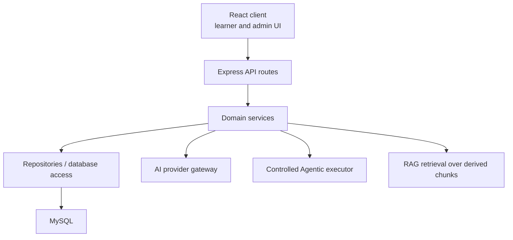

# 04. Application Architecture

**Document status:** Proposed Target Architecture  
**Implementation status:** Not Fully Implemented  
**Review status:** Subject to Current-System Audit

## Current Application Shape

The official frontend is `client/`. The official backend is `server/`. The legacy root React application has been removed as part of production cleanup.

The frontend communicates with the backend through authenticated API routes. The backend owns session handling, authorization, business rules, content governance, AI provider access, RAG retrieval, Agentic execution control, and database access.

## Target Layers

## Frontend Responsibilities

- Render learner, chat, resource, scenario, progress, and admin experiences.
- Use the shared frontend API client and domain API modules.
- Preserve server-side decisions rather than recalculating protected business logic.
- Never store secrets or trusted backend action parameters.
- Treat action cards and Agentic proposals as server-controlled instructions.

## Backend Responsibilities

- Enforce authentication and role authorization.
- Own validation and state-changing business rules.
- Own password hashing and session payloads.
- Own AI provider integration and safety boundaries.
- Own RAG retrieval and source persistence.
- Own Agentic proposal validation, confirmation, and controlled execution.
- Own Admin governance APIs.

## API Boundary

The target architecture should keep API contracts stable, explicit, and tested. Frontend refactors should not require backend response-format changes unless a versioned migration path is planned.

Legacy compatibility routes should be removed when no runtime consumers remain. Current authentication should use `/api/auth/*`.

## Admin Boundary

Admin is governance-focused. Admin APIs must enforce server-side role checks and must not expose secrets, raw prompts, password hashes, raw assessment answers, raw scenario decisions, or unnecessary learner private data.

## Planned Application Work

The specification anticipates additional production hardening such as route/module separation, expanded audit trails, staging configuration, operational monitoring, and stricter content governance. These are target elements unless verified in the repository.
