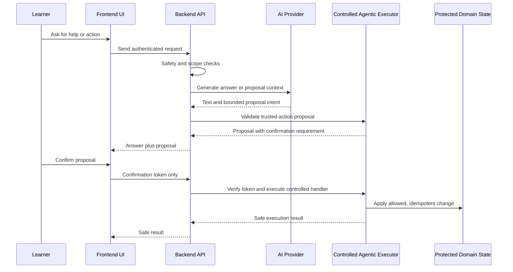

# 05. AI and Agentic Architecture

**Document status:** Proposed Target Architecture  
**Implementation status:** Not Fully Implemented  
**Review status:** Subject to Current-System Audit

## AI Boundary

CyberGuard may answer questions, explain learning concepts, use reviewed RAG context, and suggest next steps. It must not directly update protected domain state.

AI provider behavior must remain behind the backend. Provider keys, prompt internals, raw hidden learner context, diagnostics, and token/cost details must not be exposed to the frontend.

## RAG Boundary

RAG data is derived and rebuildable. It should come from reviewed, approved, RAG-ready content. Citations are evidence metadata and must remain separate from action-card routes.

Source links are metadata. They are not arbitrary action routes and should not authorize navigation or mutation.

## Agentic Boundary

Agentic AI in Cyberly means backend-orchestrated learning assistance. The model may contribute intent or proposal content only inside a controlled policy boundary.

Approved target rule: Agentic actions require proposal, confirmation, controlled execution, idempotency, and audit.

This is a conceptual target flow. Current implementation must be audited before assuming all trace, persistence, or token-storage details are complete.

## Protected State

AI and model-origin actions must not directly modify:

- assessment scores;
- scenario scores;
- progress snapshots;
- learner account security fields;
- admin content publication;
- RAG source records;
- secrets or configuration.

## Confirmation Tokens

Confirmation tokens must not be stored in plaintext. Future persistent proposal storage should store only a verifier or hash, expiry, proposal status, target metadata, and audit-safe execution state.

## Tool and Action Rules

- No arbitrary SQL tool.
- No arbitrary URL opening.
- No secret-reading tool.
- No score mutation tool.
- No model self-approval of content.
- No automatic execution without learner confirmation for write actions.
- Confirmation must not send trusted backend parameters from the frontend.
