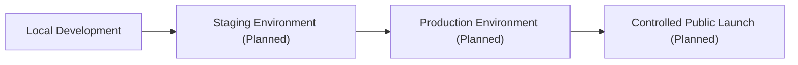

# Cyberly Production Architecture Specification

**Document status:** Proposed Target Architecture  
**Implementation status:** Not Fully Implemented  
**Review status:** Subject to Current-System Audit

This folder defines the target production architecture for Cyberly after the Capstone 1 prototype phase. It is a planning and alignment specification, not a claim that every described table, service, workflow, audit trail, deployment environment, analytics capability, or operational process already exists.

The current operating mode is local development. The previous Render and Aiven deployment was prototype infrastructure and is being retired. The future environment sequence is:

Hosting provider selection is deferred until infrastructure requirements, privacy needs, cost, latency, operations capacity, and expected learner traffic are evaluated.

## Specification Map

- `01-product-and-system-context.md`: product purpose, users, operating assumptions, and current status.
- `02-domain-architecture.md`: target business domains and domain boundaries.
- `03-data-architecture.md`: target account, learner, learning-state, content, RAG, and audit data principles.
- `04-application-architecture.md`: target frontend/backend/service architecture.
- `05-ai-and-agentic-architecture.md`: CyberGuard, RAG, Agentic AI, proposals, and controlled execution boundaries.
- `06-security-and-privacy-architecture.md`: security, privacy, identity, secrets, and protected-state rules.
- `07-deployment-and-operations.md`: local, staging, production, monitoring, backup, and operations direction.
- `08-engineering-standards.md`: code, migration, testing, documentation, and release standards.
- `09-roadmap-and-migration-strategy.md`: phased path from prototype cleanup to production readiness.
- `decisions/`: Architecture Decision Records for approved target decisions.

## Approved Target Decisions

1. `users` is a general account table.
2. `display_name` remains in `users`.
3. Learner-specific age information belongs in `learner_profiles`.
4. `birth_year` is preferred over full date of birth or permanently stored age.
5. `username` and legacy password fields are scheduled for removal.
6. Assessment records learning facts.
7. Learning Events are the intended source of truth for learning-state changes.
8. Progress is a materialized/current-state snapshot.
9. Recommendations are historical system decisions.
10. Scenario and Resource content should support stable identity and versioned publication.
11. RAG data is derived and rebuildable.
12. AI cannot directly update protected domain state.
13. Agentic actions require proposal, confirmation, controlled execution, idempotency, and audit.
14. Confirmation tokens must not be stored in plaintext.
15. The previous Render and Aiven deployment was prototype infrastructure and is being retired.
16. Current operating mode is local development.
17. Future sequence is Local -> Staging -> Production.
18. Hosting provider selection is deferred until infrastructure requirements and cost/latency criteria are evaluated.
19. Existing migrations must never be rewritten after application.
20. Destructive schema changes must use phased forward migrations.

## Interpretation Rules

- Treat diagrams as conceptual unless a document explicitly marks a component as implemented.
- Treat planned tables and workflows as target architecture only.
- Do not rewrite applied migrations to match this specification.
- Use this specification to guide current-system audit, gap analysis, and future migration planning.
