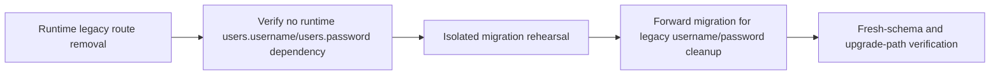
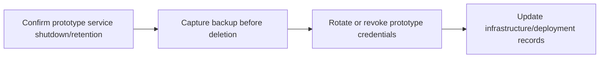
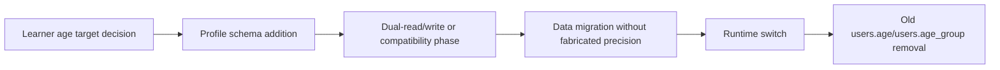
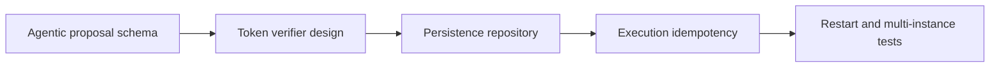
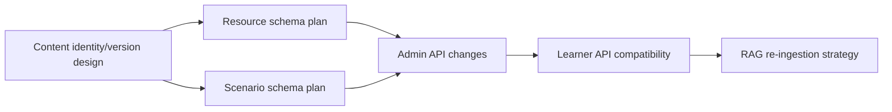
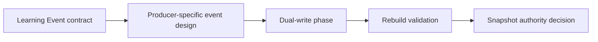

# Dependency Map

Status: Production Gap Analysis; Based on Proposed Target Architecture and Repository-Derived Current Inventory; No Live Database Verification; Snapshot Date: 2026-07-27; Priorities are planning decisions, not implementation completion claims.

This document records dependency relationships only. It is not an implementation plan.

## Legacy Identity Cleanup

Related gaps: GAP-IDN-001, GAP-IDN-002, GAP-IDN-003, GAP-IDN-004, GAP-ENG-002, GAP-ENG-003.

## Prototype Infrastructure Retirement

Related gaps: GAP-OPS-001, GAP-OPS-002, GAP-OPS-003, GAP-OPS-004.

## Learner Age Ownership

Related gaps: GAP-LRN-001, GAP-LRN-002, GAP-LRN-003, GAP-LRN-004, GAP-LRN-005.

## Agentic Proposal Hardening

Related gaps: GAP-AGT-001, GAP-AGT-002, GAP-AGT-003, GAP-AGT-004, GAP-AGT-005, GAP-AGT-006.

## Content Versioning and RAG

Related gaps: GAP-CNT-001 to GAP-CNT-006, GAP-AI-001, GAP-ADM-001.

## Learning Event Expansion

Related gaps: GAP-LNG-001 to GAP-LNG-005.

